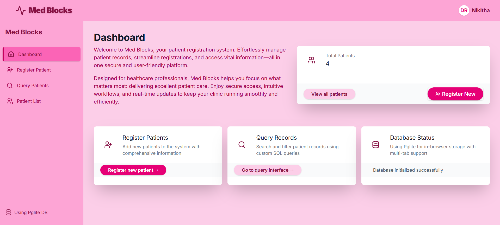
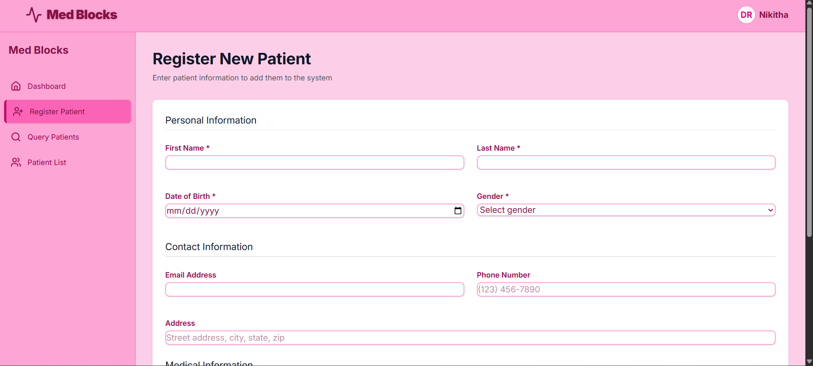
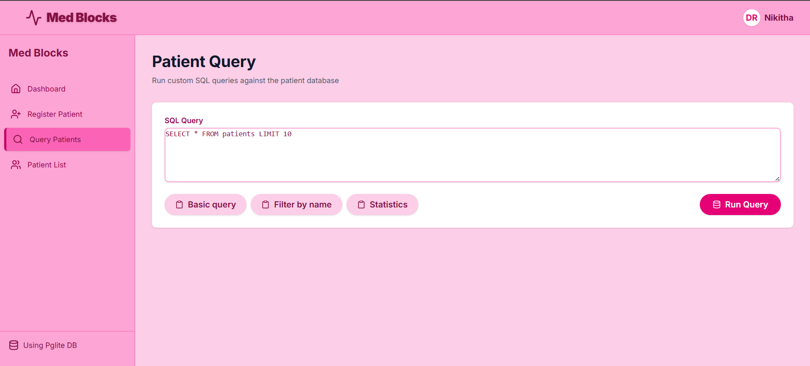
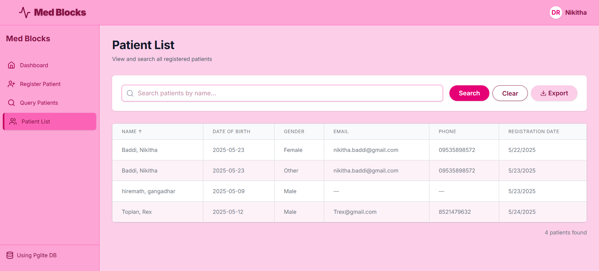

# MedicalBlocks: Patient Management System with React & PGlite

A modern patient management system that runs entirely in your browser using PGlite (WebAssembly PostgreSQL).

## 📋 Features

- **In-Browser Database**: Full PostgreSQL database running directly in the browser with PGlite
- **Offline Support**: Works without an internet connection, with data persisted in IndexedDB
- **Multi-Tab Support**: Share database state across multiple browser tabs
- **Patient Registration**: Complete form for adding patients with comprehensive medical information
- **Patient Search**: Search and filter patients by name and other attributes
- **Custom SQL Queries**: Advanced interface for querying the database directly with SQL
- **Modern UI**: Clean, responsive interface built with React

## 🚀 Demo
https://patient-management-system-bynikitha.netlify.app/

---

### Dashboard


### Patient Registration


### Patient Query


### Patient List


---

## 📦 Installation

### Prerequisites

- Node.js (v16 or higher)
- npm (v7 or higher)

### Setup Steps


```

1. Install dependencies:

```bash
npm install
```

2. Start the development server:

```bash
npm run dev
```

3. Open your browser and navigate to `http://localhost:5173`

## 🛠️ Project Structure

```
patient-system-pglite/
├── public/
│   └── pglite-worker.js     # PGlite worker for multi-tab support
├── src/
│   ├── components/          # Reusable UI components
│   ├── context/             # React context providers
│   │   └── DatabaseContext.tsx
│   ├── pages/               # Application pages
│   │   ├── Dashboard.tsx
│   │   ├── PatientList.tsx
│   │   ├── PatientQuery.tsx
│   │   └── PatientRegistration.tsx
│   ├── services/            # Core services
│   │   └── DatabaseService.ts
│   ├── App.tsx              # Main application component
│   ├── main.tsx             # Application entry point
│   └── index.css            # Global styles
├── package.json
├── tsconfig.json
└── vite.config.ts
```

## 🧩 Implementation Details

### PGlite Integration

The project uses PGlite to run PostgreSQL directly in the browser. The database is initialized in a Web Worker to support multi-tab operation and persisted using IndexedDB.

```typescript


### Database Schema


## 🔧 Available Scripts

In the project directory, you can run:

- `npm run dev` - Starts the development server
- `npm run build` - Builds the app for production
- `npm run lint` - Runs ESLint to check code quality
- `npm run preview` - Previews the production build locally

## 📱 Usage Guide

### Adding a New Patient

1. Navigate to the "Register" page using the dashboard or navigation menu
2. Fill in the required patient information
3. Click "Register Patient" to save the record

### Searching for Patients

1. Go to the "Patients" page
2. Use the search bar to find patients by name
3. Click on a patient to view their details

### Running Custom Queries

1. Navigate to the "Query" page
2. Enter your SQL query in the editor
3. Click "Execute" to run the query and view results

## 🧪 Technologies Used

- **React** - UI library
- **TypeScript** - Type safety and better developer experience
- **PGlite** - In-browser PostgreSQL database
- **React Router** - Application routing
- **Lucide React** - Icon library
- **Vite** - Build tool and development server

## 🤝 Contributing

Contributions are always welcome!

1. Fork the repository
2. Create a new branch (`git checkout -b feature/amazing-feature`)
3. Make your changes
4. Commit your changes (`git commit -m 'Add some amazing feature'`)
5. Push to the branch (`git push origin feature/amazing-feature`)
6. Open a Pull Request

Please make sure to update tests as appropriate.


## 🙏 Acknowledgements

- [Pglite Docs](https://pglite.dev/docs/) for developing PGlite
- [Vite](https://vitejs.dev/) for the blazing fast build tool
- [React](https://reactjs.org/) for the UI library

---

⭐ Found this project useful? Please consider giving it a star on GitHub! ⭐
